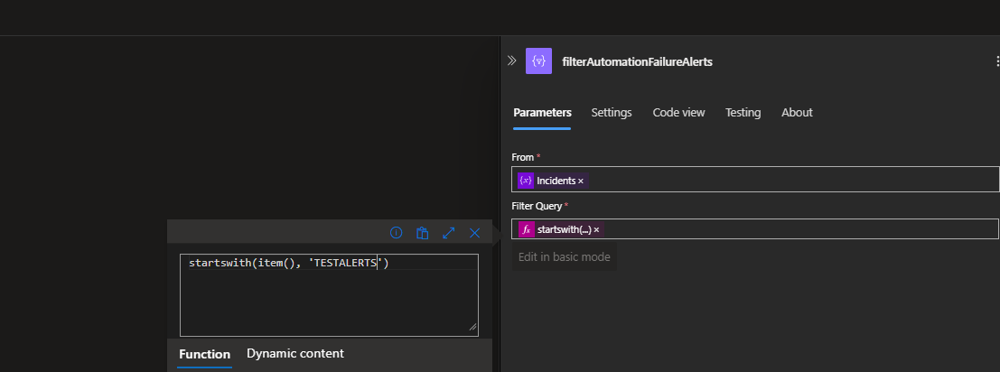

# **Mass Incident Deletion Logic App**

This Logic App allows you to mass delete incidents from your Azure Sentinel environment, particularly useful for clearing forgotten test incidents that can skew your data metrics.

## **Prerequisites**
1. **Azure Service Principal** with **Azure Sentinel Reader/Writer** permissions.
2. **Azure Key Vault** configured to securely store your Service Principal credentials (Tenant ID, Client ID, and Client Secret).

---

## **Step-by-Step Instructions**

### **1. Create a Service Principal with Sentinel Permissions**
- **Create a Service Principal** with Azure Sentinel Reader/Writer permissions.
- Ensure the Service Principal has access to your Sentinel Workspace.

### **2. Store Service Principal Credentials in Azure Key Vault**
- Go to **Azure Key Vault**.
- Add the following secrets to the Key Vault:
  - **Tenant ID**: Store this value under the secret name `TenantID`.
  - **Client ID**: Store this value under the secret name `ClientID`.
  - **Client Secret**: Store this value under the secret name `ClientSecret`.
  
### **3. Set Up the Logic App**

1. **Add a Key Vault Connector**:
   - In your Logic App, add the **Azure Key Vault** connector.
   - Use this connector to retrieve the `TenantID`, `ClientID`, and `ClientSecret` from your Key Vault.

2. **Request a Bearer Token**:
   - Use the `TenantID`, `ClientID`, and `ClientSecret` to make an API request to Azure AD, requesting a bearer token that grants access to Azure Sentinel.

3. **Pull All Incidents**:
   - Perform a **GET request** to retrieve all incidents in the Sentinel environment. Use the **Microsoft Sentinel REST API** for this operation.

4. **Select Incidents to Delete**:
   - Add a **Select operation** where you specify the incidents you want to target by their **incident title**. 
   - Customize the selection criteria in this step to focus on test incidents or any other specific type.

5. **Extract Incident IDs**:
   - Once incidents are selected, segment and extract their **Incident IDs**.

6. **Iterate and Delete Incidents**:
   - Use an **API Delete request** to delete incidents. 
   - Iterate through each Incident ID pulled from the previous step and delete them from Sentinel one by one.

---

## **Customizing the Incident Selection**

To modify which incidents get deleted:
- Go to the **Select operation** and adjust the filter criteria to focus on incidents based on their **title**, **severity**, or any other parameter.
  
---

## **Running the Logic App**

Once the Logic App is set up, you can either:
- Trigger it manually whenever needed.
- Set up a scheduled trigger to automatically clean up old test incidents regularly.

---

## **Security Notes**
- Ensure that your Service Principal credentials are securely stored and managed within Azure Key Vault.
- Only authorized personnel should have access to the Key Vault and Logic App configurations.
